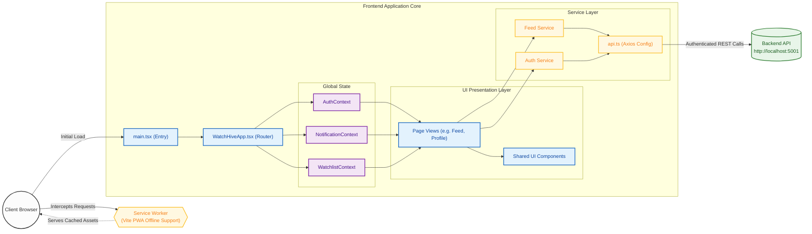
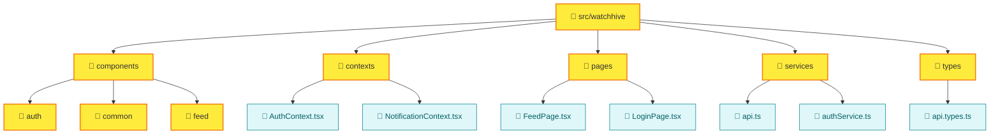
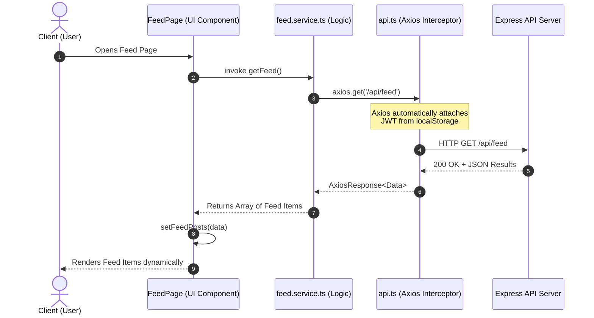

# WatchHive Frontend Architecture & Tech Stack

## Overview
This document outlines the technology stack and architectural design of the WatchHive frontend application. 

> **💡 Note for viewing diagrams:** Standard Markdown doesn't natively support zoom, pan, and fullscreen out of the box. 
> To view these diagrams interactively (with scroll to zoom, click & drag to pan, and a fullscreen toggle button), please open the `architecture-viewer.html` file in your web browser. 

## Technology Stack

| Category | Technology | Description |
| :--- | :--- | :--- |
| **Core Framework** | **React (v18)** | The primary library for building the user interface. Uses functional components and React Hooks heavily. |
| **Language** | **TypeScript** | Adds static typing to JavaScript to improve developer experience and catch errors early. |
| **Build Tool** | **Vite (v5)** | A fast frontend build tool used for serving the app during development and bundling for production. |
| **Routing** | **React Router (v6)**| Declarative routing for React applications to handle navigation between pages. |
| **HTTP Client** | **Axios** | Promise-based HTTP client for the browser to interact with the backend API. |
| **Animations** | **Framer Motion**| A production-ready motion library for React to handle UI animations smoothly. |
| **PWA Support** | **Vite PWA Plugin**| Enables Progressive Web App features such as offline support, service workers, and caching capabilities (`vite-plugin-pwa`). |
| **State Mgt.** | **React Context** | Used across the App for managing global states (e.g. `AuthContext`, `NotificationContext`, `WatchlistContext`). |
| **Testing** | **Playwright** | Used for End-to-End (E2E) testing (`@playwright/test`). |
| **Styling** | **Vanilla CSS** | Standard CSS used for component and page-level styling. |

---

## High-Level Architecture

The architecture follows a standard component-service design pattern. The application is segregated into distinct layers for modularity and scalability.

**Interactive Diagram**: *You can click on the colored nodes below to navigate directly to the corresponding source code definitions.*

---

## Directory Structure Representation

The repository structure inside `src/watchhive/` cleanly groups related responsibilities:

---

## Data Flow (Example: Fetching the User's Feed)

This diagram visualizes how data requests flow through the React application structure — from user interaction down to the backend.

## Progressive Web App (PWA) Capabilities

- The app uses `vite-plugin-pwa` with `autoUpdate` registerType.
- Caching strategies are defined in `vite.config.ts` using `workbox`.
- **Google Fonts** rely on `CacheFirst`.
- **API calls** (`/api/.*`) use `NetworkFirst` to gracefully handle offline scenarios.
- **Images** use `StaleWhileRevalidate`.
- Intercepts navigation requests using `navigateFallback: 'index.html'` to avoid standard 404 behavior and allow React router to render appropriate catch-all layouts.
